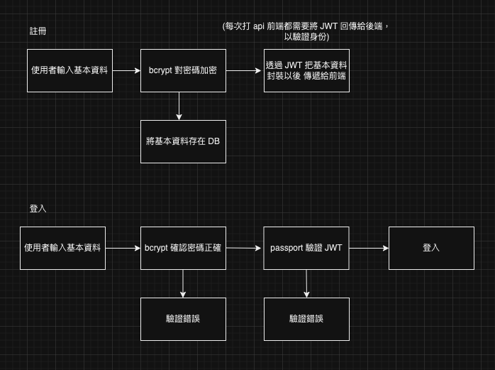

# Nest Login System

### Basic Info

```bash
DB: PostgreSql
```

### feature

**註冊**

**登入**

**使用者更換密碼(update)**

**email 驗證**

**註銷帳號**

[swagger document](http://localhost:8080/api#/)

### auth lifeCycle chart


